# sTalk

<div align="center">


**sTalk is a self-hosted web application designed for private, encrypted texting and file sharing — built entirely by AI, with no human-written code.
Host it on your own hardware to keep your conversations and data completely under your control.**

[Features](#-features) • [Quick Install](#-quick-installation) • [Screenshots](#-Screenshots) • [Documentation](#-documentation)

</div>

---

## 📱 About sTalk

sTalk is a production-ready, real-time communication platform 100% designed by AI for those need secure, fast, and reliable messaging app hosted on their own hardware. 

**Perfect for:**
- Family and friends for private chats
- Self-hosted messaging solutions
- Privacy-conscious people

---

## ✨ Features

### 🚀 Core Functionality
- **Real-time Messaging** - Instant message delivery powered by Socket.IO
- **File Sharing** - Share images, audio, video, documents
- **User Authentication** - Secure JWT-based authentication system
- **Online Status** - See who's online in real-time
- **Typing Indicators** - Know when someone is typing

### 👤 User Management
- **Role-Based Access** - Admin and User roles with different permissions
- **Profile Customization** - Upload profile pictures or use text avatars
- **Password Management** - Users can change their own passwords
- **User Search** - Quickly find and message team members

### 🎨 User Interface
- **Dark/Light Mode** - MUST - Toggle between themes for comfortable viewing
- **Mobile-First Design** - Optimized for mobile devices with responsive layout
- **Long-Press Actions** - Reply, copy, or delete messages with long-press
- **Swipe Gestures** - Intuitive swipe navigation
- **Unread Message Counters** - Never miss important messages

### 🛡️ Security & Administration
- **Rate Limiting** - Protection against abuse and spam
- **Admin Dashboard** - System statistics and usage monitoring
- **User Management Panel** - Admin can create, delete users, and reset passwords
- **Secure File Upload** - Type validation and size limits
- **Session Management** - Automatic token expiration

### 📁 File Management
- **Multiple File Types** - Support for images, audio, video, PDFs, documents, archives
- **Smart Categorization** - Automatic file type detection and organization
- **Thumbnail Support** - Preview images directly in chat
- **File Metadata** - Track uploads with size, type, and uploader info

---

## 🚀 Quick Installation

Install sTalk with a single command:

### Using curl:
```bash
curl -fsSL https://raw.githubusercontent.com/JungleeAadmi/sTalk/main/install.sh | sudo bash
```

### Using wget:
```bash
wget -qO- https://raw.githubusercontent.com/JungleeAadmi/sTalk/main/install.sh | sudo bash
```
### Update / Upgrade sTalk

This command updates the application code while preserving the database and uploads. It creates backups under `/root` before updating.

```bash
# Preferred (runs update.sh from the repo via sudo)
sudo bash -c "$(wget -qO- https://raw.githubusercontent.com/JungleeAadmi/sTalk/main/update.sh)"
```

### Update check (dry run update test)

```
curl -fsSL https://raw.githubusercontent.com/JungleeAadmi/sTalk/main/update-check.sh | sudo bash

```
or

```
sudo bash -c "$(wget -qO- https://raw.githubusercontent.com/JungleeAadmi/sTalk/main/update-check.sh)"

```

### Run rollback.sh (Restore DB + uploads + VAPID)

```
curl -fsSL https://raw.githubusercontent.com/JungleeAadmi/sTalk/main/rollback.sh | sudo bash

```
```
sudo bash -c "$(wget -qO- https://raw.githubusercontent.com/JungleeAadmi/sTalk/main/rollback.sh)"

```

### Health check 

```
curl -fsSL https://raw.githubusercontent.com/JungleeAadmi/sTalk/main/health-check.sh | sudo bash
```
```
sudo bash -c "$(wget -qO- https://raw.githubusercontent.com/JungleeAadmi/sTalk/main/health-check.sh)"
```

### Self repair from backups

```
curl -fsSL https://raw.githubusercontent.com/JungleeAadmi/sTalk/main/self-repair.sh | sudo bash

```

```
sudo bash -c "$(wget -qO- https://raw.githubusercontent.com/JungleeAadmi/sTalk/main/self-repair.sh)"

```

### Clean old backups

```
curl -fsSL https://raw.githubusercontent.com/JungleeAadmi/sTalk/main/cleanup-old-backups.sh | sudo bash

```

```
BACKUP_DIR=/root DAYS=60 DRY_RUN=true sudo bash -c "$(wget -qO- https://raw.githubusercontent.com/JungleeAadmi/sTalk/main/cleanup-old-backups.sh)"

```

### Log export

```
curl -fsSL https://raw.githubusercontent.com/JungleeAadmi/sTalk/main/log-export.sh | sudo bash

```
```
sudo bash -c "$(wget -qO- https://raw.githubusercontent.com/JungleeAadmi/sTalk/main/log-export.sh)"

```


### Uninstall:
```
sudo bash -c "$(wget -qO- https://raw.githubusercontent.com/JungleeAadmi/sTalk/main/uninstall.sh)"

```
### If wish to remove the whole thing

```
sudo rm -rf /opt/stalk && sudo rm -f /etc/systemd/system/stalk.service && sudo systemctl daemon-reload && echo "Removed /opt/stalk and systemd unit"

```
The installer will automatically:
✅ Detect your operating system  
✅ Install Node.js and npm (if not present)  
✅ Clone the repository  
✅ Install dependencies  
✅ Generate VAPID keys (for Web Push) and set them in the environment
✅ Set up the database  
✅ Create a systemd service  
✅ Start sTalk automatically  

**Access your installation at:** `http://your-server-ip:3000`

**Default Admin Credentials:**
- Username: `admin`
- Password: `admin`

⚠️ **Important:** Change the admin password immediately after first login!

## VAPID & Push Notifications (concise)

What is VAPID?
VAPID (Voluntary Application Server Identification) is the public/private key pair used with Web Push (browser push) to authenticate your server to push services (Chrome/Firefox/Edge).

How sTalk handles it:
The installer automatically generates a VAPID key pair and stores them as environment variables (used by the server). End users installing sTalk via the provided installer do not need to manually edit JS files for VAPID keys.

If self-hosting manually:

Generate keys with npx web-push generate-vapid-keys or let installer do it.

Set VAPID_PUBLIC_KEY and VAPID_PRIVATE_KEY in your environment before starting the server.

## Environment variables (important)

Place these in systemd service or your environment:

```
PORT=3000
NODE_ENV=production
JWT_SECRET="replace-with-strong-secret"
VAPID_PUBLIC_KEY="(auto-generated by installer)"
VAPID_PRIVATE_KEY="(auto-generated by installer)"
VAPID_SUBJECT="mailto:you@example.com"
DB_PATH="./database/stalk.db"
UPLOAD_PATH="./uploads"
PROFILE_PATH="./uploads/profiles"

```
---
## 🖼️ Screenshots

### Admin Only - Password Generation
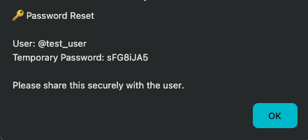
- *Admin can generate secure temporary passwords for users*

### Admin Only - User Management
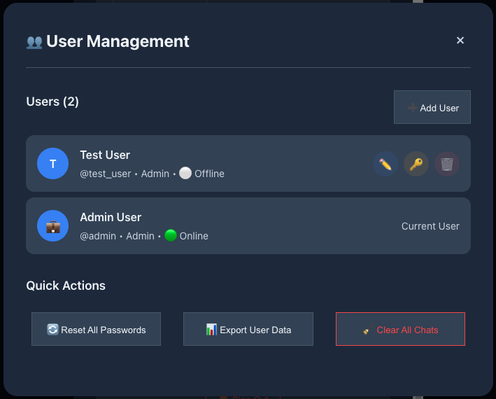
- *Complete user management dashboard for administrators*

### Admin Only - System Statistics
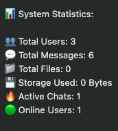
- *View detailed system statistics and usage metrics*

### Create Admin User
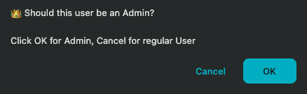
- *Easy admin user creation during setup*

### Dark Mode Toggle
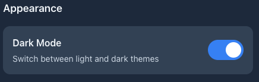
- *Comfortable dark mode for low-light environments*

### Delete User
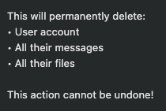
- *Safe user deletion with confirmation*

### Profile Picture Options
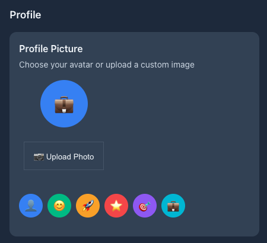
- *Customize your profile with images or avatars*

### Change Password
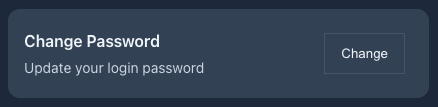
- *Secure password change functionality*

### Mobile browser - New conversation
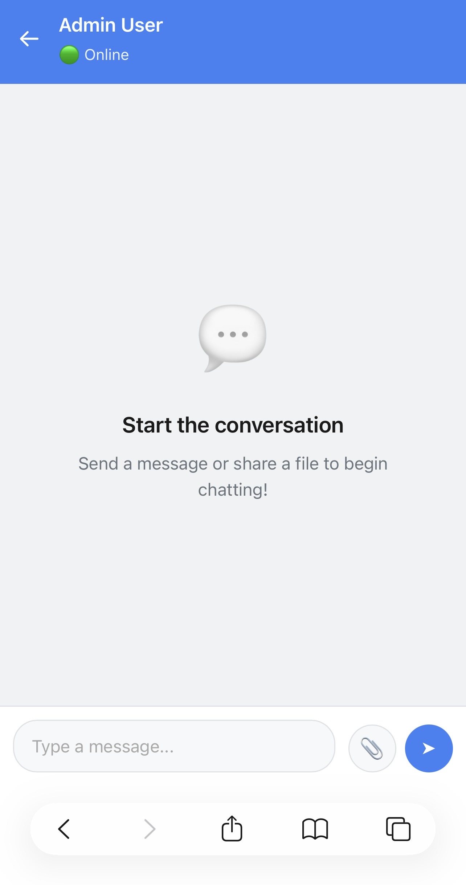
- *Mobile browser chat screen*

### attachment options
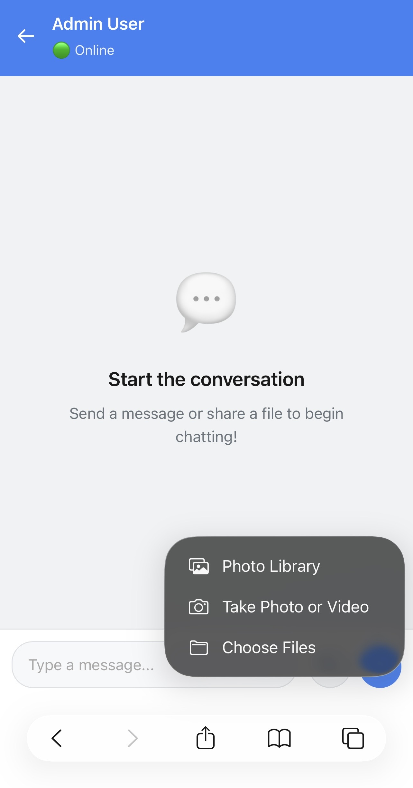
- *how to attach files and share securely*

### Mobile browser - welcome screen/users list
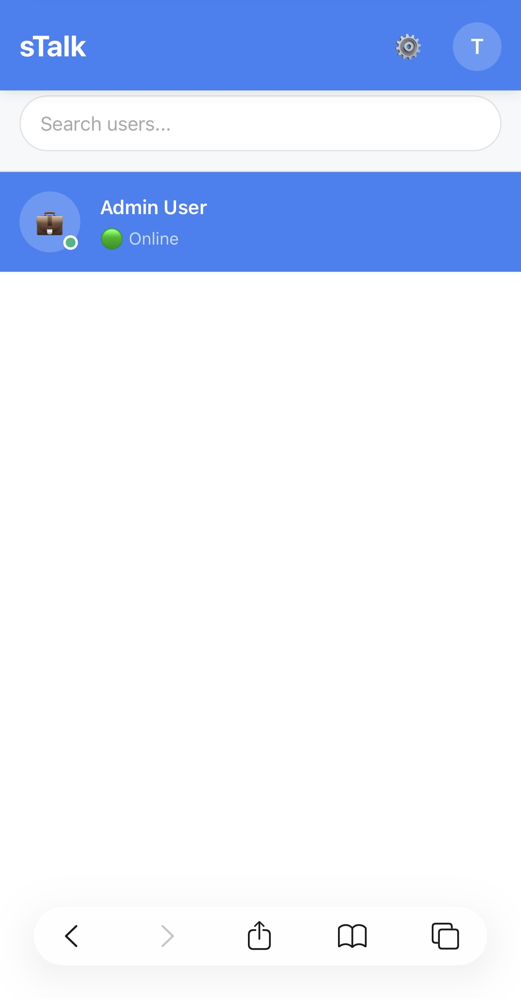
- *List of users in this hosted version, anyone can message any user*

### Mobile browser - Chat bubble features
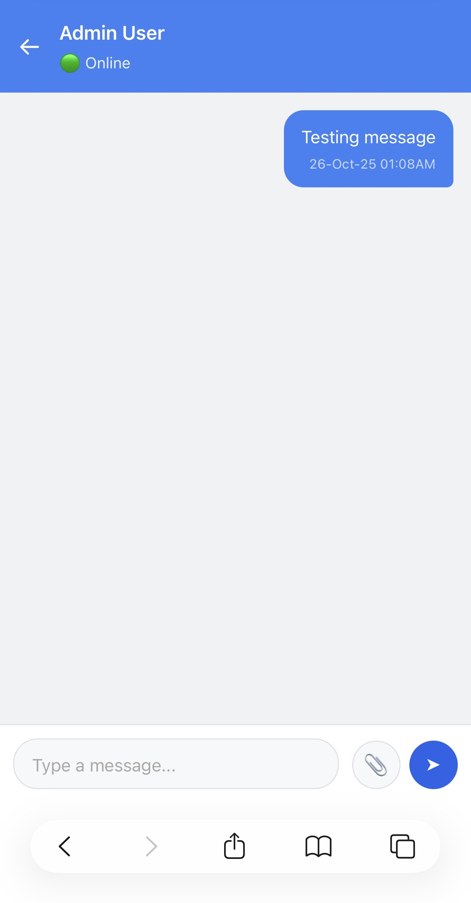
- *chat bubble*

---

### File Structure
```
/opt/sTalk
├─ server.js
├─ public/
│  ├─ index.html
│  ├─ app.js
│  ├─ sw.js
│  └─ push-client.js
├─ package.json
├─ database/stalk.db
└─ uploads/
   ├─ images
   ├─ audio
   ├─ files
   └─ profiles

```

---

## 📚 Documentation

### Default Admin Account
- **Username:** `admin`
- **Password:** `admin`
- **Role:** Admin

### User Roles

#### Admin Capabilities:
- All user capabilities
- View system statistics
- Create new users with temporary passwords
- Delete users (except self)
- Reset user passwords
- Access admin dashboard
- View user management panel

#### User Capabilities:
- Send and receive real-time messages
- Share files (up to 50MB)
- Upload profile pictures
- Change own password
- Toggle dark/light theme
- Search for other users
- View online status
- Use typing indicators

### API Endpoints

#### Authentication
- `POST /api/auth/login` - User login
- `GET /api/auth/me` - Get current user info
- `POST /api/auth/change-password` - Change password
- `POST /api/auth/logout` - User logout

#### Users
- `GET /api/users` - Get all users (with search)
- `GET /api/chats/:otherUserId` - Get chat messages
- `POST /api/chats/:otherUserId/messages` - Send message

#### Admin (requires admin role)
- `GET /api/admin/stats` - System statistics
- `GET /api/admin/users` - User management
- `POST /api/admin/users` - Create new user
- `DELETE /api/admin/users/:id` - Delete user
- `POST /api/admin/reset-password/:id` - Reset user password
- `GET /api/admin/export` - Export data

#### Profile
- `POST /api/profile/image` - Upload profile picture
- `POST /api/profile/avatar` - Set text avatar

#### File Upload
- `POST /api/upload` - Upload files (max 10 files, 50MB each)

### WebSocket Events

#### Client → Server
- `join_user_room` - Join user's room
- `typing_start` - User started typing
- `typing_stop` - User stopped typing

#### Server → Client
- `user_status_changed` - User online/offline status changed
- `user_typing` - User typing indicator
- `new_message` - New message received

---

## 🛠️ Development

### Running in Development Mode
```bash
npm run dev
```

### Project Dependencies
```json
{
  "express": "^4.18.2",
  "sqlite3": "^5.1.6",
  "bcryptjs": "^2.4.3",
  "jsonwebtoken": "^9.0.2",
  "socket.io": "^4.7.3",
  "cors": "^2.8.5",
  "helmet": "^7.0.0",
  "express-rate-limit": "^6.10.0",
  "multer": "^1.4.5-lts.1",
  "mime-types": "^2.1.35"
}
```

---

## 🚀 Deployment

### Using the Automated Installer
The easiest way to deploy sTalk is using our one-line installer which handles everything automatically.

### Docker Deployment (Coming Soon)
Docker support is planned for future releases.

### Reverse Proxy Setup

#### Nginx Example
```nginx
server {
    listen 80;
    server_name your-domain.com;

    location / {
        proxy_pass http://localhost:3000;
        proxy_http_version 1.1;
        proxy_set_header Upgrade $http_upgrade;
        proxy_set_header Connection 'upgrade';
        proxy_set_header Host $host;
        proxy_cache_bypass $http_upgrade;
        proxy_set_header X-Real-IP $remote_addr;
        proxy_set_header X-Forwarded-For $proxy_add_x_forwarded_for;
    }
}
```

#### Apache Example
```apache
<VirtualHost *:80>
    ServerName your-domain.com
    
    ProxyRequests Off
    ProxyPreserveHost On
    
    ProxyPass / http://localhost:3000/
    ProxyPassReverse / http://localhost:3000/
    
    RewriteEngine on
    RewriteCond %{HTTP:Upgrade} websocket [NC]
    RewriteCond %{HTTP:Connection} upgrade [NC]
    RewriteRule ^/?(.*) "ws://localhost:3000/$1" [P,L]
</VirtualHost>
```

---

## 🔐 Security

### Best Practices
1. **Change default credentials** immediately after installation
2. **Use strong JWT secret** - Set a random, complex `JWT_SECRET` environment variable
3. **Enable HTTPS** - Use a reverse proxy with SSL/TLS certificates
4. **Regular updates** - Keep Node.js and dependencies up to date
5. **Firewall rules** - Only expose necessary ports
6. **Backup database** - Regularly backup the SQLite database

### Built-in Security Features
- JWT-based authentication
- bcrypt password hashing
- Rate limiting on API endpoints
- File type validation
- File size restrictions
- Helmet.js security headers
- CORS protection

---

## 🐛 Troubleshooting

### Service won't start
```bash
# Check service status
sudo systemctl status stalk

# View logs
sudo journalctl -u stalk -f

# Check if port 3000 is already in use
sudo lsof -i :3000
```

### Database issues
```bash
# Remove and recreate database
rm -rf database/
mkdir database
# Restart service - database will be recreated
sudo systemctl restart stalk
```

### Permission issues
```bash
# Fix ownership
sudo chown -R $USER:$USER /opt/sTalk

# Fix permissions
sudo chmod -R 755 /opt/sTalk
```

---

## 🤝 Contributing

Contributions are welcome! Please feel free to submit a Pull Request.

### Development Setup
1. Fork the repository
2. Create your feature branch (`git checkout -b feature/AmazingFeature`)
3. Commit your changes (`git commit -m 'Add some AmazingFeature'`)
4. Push to the branch (`git push origin feature/AmazingFeature`)
5. Open a Pull Request

---

## 📝 License

This project is licensed under the MIT License - see the [LICENSE](LICENSE) file for details.

---

## 🙏 Acknowledgments

- Built with [Node.js](https://nodejs.org/)
- Real-time communication powered by [Socket.IO](https://socket.io/)
- Styled with modern CSS and responsive design principles

---

## 📞 Support

- **Issues:** [GitHub Issues](https://github.com/JungleeAadmi/sTalk/issues)
- **Discussions:** [GitHub Discussions](https://github.com/JungleeAadmi/sTalk/discussions)

---

## 🗺️ Roadmap

- [ ] Docker support
- [ ] End-to-end encryption
- [ ] Group chats
- [ ] Video/audio calls
- [ ] Message search
- [ ] File preview for more formats
- [ ] Message reactions
- [ ] User presence (away, busy, etc.)
- [ ] Push notifications
- [ ] Mobile apps (iOS/Android)

---

<div align="center">

**Made with ❤️ for teams who value privacy and control**

⭐ Star this repo if you find it helpful!

[Report Bug](https://github.com/JungleeAadmi/sTalk/issues) · [Request Feature](https://github.com/JungleeAadmi/sTalk/issues)

</div>
